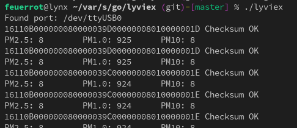
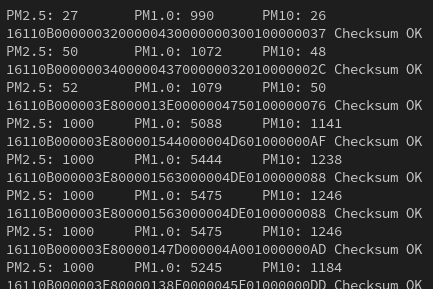

# IKEA VINDRIKTNING Prometheus Exporter (WIP)

You probably don't want to rely on the PM1.0 and PM10 values too much, as they might not be anywhere near the true value, even if they rise.
The PM2.5 value seems to be capped at 1000.

